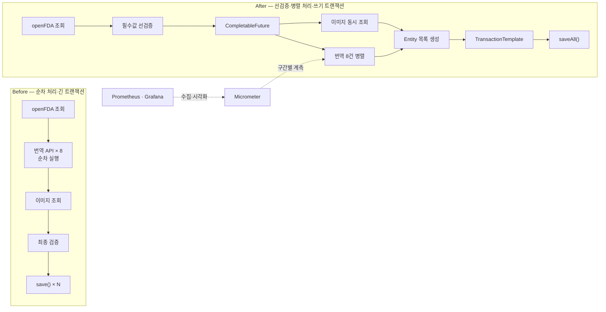

# 💊 어디약 — 글로벌 의약품 정보 플랫폼

> 국내외 의약품 데이터를 수집·번역·정규화하고, 한국 사용자에게 일관된 형태로 제공하는 서비스입니다.

이 저장소는 팀 프로젝트 [PharmQuest/BE](https://github.com/PharmQuest/BE)를 기반으로, 제가 담당한 **의약품 데이터 파이프라인·성능 최적화·검색/스크랩·AWS 배포 및 운영 대응**을 기록한 개인 포트폴리오용 Fork입니다.

## 👨‍💻 담당 역할

**Backend Developer · Infrastructure**

- openFDA·DailyMed·식약처 OpenAPI 기반 국내외 의약품 수집 파이프라인 설계 및 구현
- Google Translation API 기반 해외 의약품 현지화와 공통 `Medicine` 모델 정규화
- 복합 검색·페이지네이션과 JWT 기반 사용자별 의약품 스크랩 기능 구현
- Micrometer·Prometheus·Grafana 기반 병목 계측 및 비동기·트랜잭션 구조 최적화
- GitHub Actions와 AWS EC2·RDS를 이용한 CI/CD 및 운영 환경 구성

## 💼 주요 개인 기여

| 영역 | 문제 · 해결 · 결과 |
|---|---|
| **성능 최적화** | 번역·이미지 API의 순차 실행으로 INSERT가 지연되는 문제를 `CompletableFuture` 병렬 처리와 실행 순서 변경으로 해결하여, 30건 평균 처리시간을 **37.639초 → 8.721초(76.8% 단축)**로 개선했습니다. |
| **국내외 데이터 통합** | 한국 공공데이터와 미국 FDA 데이터의 서로 다른 필드 구조 문제를 국가별 DTO·Converter와 공통 `Medicine` 모델로 정규화하여, 국내외 의약품의 일관된 저장·조회 기반을 구축했습니다. |
| **해외 의약품 현지화** | 영문 FDA 데이터의 비정형 필드와 언어 장벽 문제를 openFDA·DailyMed·Google Translation API 연계 및 증상 카테고리 매핑으로 해결하여, 한국어 기반의 동일한 응답 형식으로 제공했습니다. |
| **복합 검색** | 전체·카테고리 조회만으로 원하는 의약품을 찾기 어려운 문제를 제품명·효능·카테고리·국가 조건과 페이지네이션을 조합한 검색 API로 해결했습니다. |
| **사용자 스크랩** | 사용자별 저장 여부를 확인할 수 없는 문제를 JWT 기반 스크랩 생성·조회·삭제와 `isScrapped` 개인화 응답으로 해결하여 일관된 저장 경험을 제공했습니다. |
| **CI/CD·배포 자동화** | 수동 빌드·JAR 교체의 반복과 환경 차이 문제를 GitHub Actions의 JDK 17·Gradle 빌드, Secrets 설정 주입, SCP·SSH 배포로 해결하여 `main` 반영 후 EC2 자동 배포 환경을 구축했습니다. |
| **운영 장애 대응** | 배포 후 RDS 연결, HTTPS Origin, 외부 이미지 접근 문제를 MySQL 의존성·환경설정, CORS·Swagger 주소, S3 URL 관리와 Fallback으로 해결하여 EC2–RDS 운영 API를 안정화했습니다. |

## 🚀 핵심 성과 — 의약품 데이터 INSERT 성능 최적화

단순히 비동기를 도입하는 데 그치지 않고 **계측 → 가설 수립 → 동일 조건 검증** 순서로 병목을 제거했습니다. 실제 외부 API가 포함된 End-to-End 테스트에서 30건 저장 평균 시간을 **37.639초 → 8.721초(76.8% 감소)**로 개선했습니다.

| 개선 단계 | 적용 내용 | 평균 처리시간 | 이전 단계 대비 |
|---|---|---:|---:|
| Baseline | 번역·이미지 순차 처리, 건별 저장 | 37.639초 | - |
| 1차 | 번역 8건 `CompletableFuture` 병렬화 | 15.503초 | 58.8% 감소 |
| 2차 | 외부 API와 DB 트랜잭션 분리 | 15.041초 | 3.0% 감소 |
| 3차 | 이미지 조회를 번역과 동시에 시작 | **8.721초** | 42.0% 감소 |

100건 부하 조건에서는 개선 전 WebClient 기본 버퍼 초과로 **0/3 성공**했으나, 최종 구조에서는 **5/5 성공, 평균 28.143초**를 기록했습니다. Repository 저장 작업도 건별 `save()`에서 `saveAll()`로 변경하여 **100회 → 1회**로 축소했습니다.

> `saveAll()` 결과는 Repository 메서드 호출 횟수 기준이며, INSERT SQL이 한 번만 실행됐다는 의미는 아닙니다.

## 🧪 재현 가능한 성능 검증

전후 버전은 같은 입력·DB·실행 환경에서 워밍업 후 반복 측정했습니다.

| 항목 | 고정 조건 |
|---|---|
| 측정 일자 | 2026-09-10 |
| 실행 환경 | Windows 11 Pro, Intel Core i7-9700K 8 Core, RAM 15.9GB |
| Runtime / DB | Java 17, Docker Desktop Linux Container, MySQL 8.4 |
| 외부 API | openFDA·Google Translation·DailyMed 실제 호출 |
| 요청 | `POST /medicine/save?category=PAIN_RELIEF&limit=30` |
| 반복 방식 | 버전별 워밍업 1회 제외, 본 측정 5회 |
| DB 조건 | 버전별 독립 스키마, 매 요청 전 데이터 초기화 |
| 성공 조건 | HTTP 201 응답 및 의약품 30건 저장 |

| 단계 | Commit | 평균 | 중앙값 | 최소 | 최대 | 표준편차 | 성공 |
|---|---|---:|---:|---:|---:|---:|---:|
| 순차 처리 | [`5e550d2`](https://github.com/joamksh/BE/commit/5e550d2) | 37.639초 | 37.627초 | 37.035초 | 38.080초 | 0.374초 | 5/5 |
| 번역 병렬화 | [`92e925e`](https://github.com/joamksh/BE/commit/92e925e) | 15.503초 | 15.498초 | 15.357초 | 15.628초 | 0.088초 | 5/5 |
| 트랜잭션 축소 | [`0d92672`](https://github.com/joamksh/BE/commit/0d92672) | 15.041초 | 15.021초 | 14.825초 | 15.304초 | 0.163초 | 5/5 |
| 이미지 동시 처리 | [`c7fbf49`](https://github.com/joamksh/BE/commit/c7fbf49) | **8.721초** | 8.729초 | 8.579초 | 8.846초 | 0.097초 | 5/5 |

- [성능 테스트 상세 기록](resume/evidence/medicine-insert-benchmark.md)
- [반복 측정 PowerShell 스크립트](scripts/measure-medicine-save.ps1)

> 실제 외부 API의 네트워크 지연을 포함한 통합 테스트이며 표본은 단계별 5회입니다. 따라서 해당 테스트 환경의 비교 지표로 해석해야 하며 P95/P99나 운영 트래픽 성능을 일반화하지 않았습니다.

## 🔍 문제 해결과 의사결정

<strong>1. 계측과 선검증으로 실제 병목 식별</strong>

### Background

openFDA 조회 후 8개 필드 번역, DailyMed 이미지 조회, MySQL 저장까지 하나의 파이프라인으로 처리했습니다. 데이터가 늘면서 응답은 느려졌지만 전체 시간만으로는 먼저 개선할 구간을 판단할 수 없었습니다.

### Problem

- FDA 조회·번역·이미지·DB 저장 구간별 처리시간을 구분할 지표가 없었습니다.
- 필수값이 없는 데이터도 번역과 이미지 조회를 마친 뒤 탈락했습니다.
- 100건 이상 응답에서 WebClient 기본 메모리 버퍼 초과가 발생했습니다.

### Hypothesis

DB INSERT보다 호출 횟수가 많은 번역·이미지 외부 API가 전체 시간을 지배할 것으로 가정했습니다.

### Why & Decision

근거 없이 DB 튜닝이나 비동기화를 적용하면 복잡도만 높아질 수 있어 관측 가능성 확보를 우선했습니다. 필수값 선검증은 구현 비용이 낮으면서 불필요한 외부 API 시간과 호출 비용을 함께 줄일 수 있어 첫 개선안으로 선택했습니다.

### Solution

- Spring Actuator·Micrometer의 `MeterRegistry`, `Timer`로 FDA·번역·이미지·변환·DB 저장 시간을 분리했습니다.
- Docker Compose 기반 Prometheus·Grafana 환경에서 구간별 지표를 확인했습니다.
- `hasRequiredRawFields()`를 번역 전에 실행하고 WebClient `maxInMemorySize`를 10MB로 조정했습니다.

### Result

100건 변환 86.69초 중 번역 56.77초, 이미지 29.92초, DB 저장 0.36초로 외부 API가 핵심 병목임을 확인했습니다. 고비용 작업 전에 유효하지 않은 데이터를 제거했고 최종 버전은 100건 요청을 5회 모두 처리했습니다.

### Trade-off & Limitation

10MB 버퍼는 대용량 응답 오류를 해결하지만 동시 요청 증가 시 메모리 사용량도 커집니다. 데이터 규모가 더 커진다면 버퍼 확장보다 페이지·청크 또는 스트리밍 수집이 필요합니다.

<strong>2. 번역·이미지 API의 제한된 병렬 처리</strong>

### Background

의약품 한 건마다 제품명·성분·효능·복용법·경고 등 8개 필드를 번역하고 DailyMed에서 이미지를 조회해야 했습니다.

### Problem

- 서로 독립적인 번역 8건이 순차 실행되고 번역이 끝난 후에야 이미지 조회가 시작됐습니다.
- 무제한 병렬화는 외부 API Rate Limit과 애플리케이션 스레드 고갈 위험이 있었습니다.

### Hypothesis

독립적인 I/O 작업을 제한된 동시성으로 실행하면 전체 시간을 각 호출의 합이 아닌 가장 오래 걸리는 병렬 구간에 가깝게 줄일 수 있다고 판단했습니다.

### Why & Decision

모든 결과가 있어야 `Medicine` Entity를 생성할 수 있으므로 Fire-and-forget 이벤트 방식보다 결과 조합이 가능한 `CompletableFuture`가 적합했습니다. 공용 풀 대신 번역·이미지 전용 `ThreadPoolTaskExecutor`를 분리해 한 외부 API의 지연이 다른 작업까지 점유하지 않도록 했습니다.

### Solution

- 번역·이미지 Executor를 각각 Core 4, Max 4, Queue 100으로 구성했습니다.
- `CompletableFuture.supplyAsync()`로 번역 8건을 병렬 실행하고 `allOf().join()`으로 결과를 결합했습니다.
- 이미지 Future를 먼저 시작하도록 코드 순서를 변경해 번역과 이미지 조회가 동시에 진행되도록 했습니다.

### Result

번역 병렬화로 평균 시간이 37.639초에서 15.503초로 58.8% 감소했고, 이미지 동시 실행으로 15.041초에서 8.721초로 다시 42.0% 감소했습니다. 최종 버전은 5회 모두 HTTP 201과 30건 저장 조건을 충족했습니다.

### Trade-off & Limitation

단일 요청은 빨라졌지만 외부 API 동시 호출과 스레드 사용량은 증가했습니다. 현재 풀 크기는 테스트 환경 기준이므로 운영 트래픽과 Rate Limit에 맞춰 재조정해야 하며 Timeout·Retry·Fallback·Circuit Breaker도 후속 과제로 남아 있습니다.

<strong>3. 외부 API와 DB 트랜잭션 생명주기 분리</strong>

### Background

초기 구현은 의약품 저장 메서드 전체에 `@Transactional`을 적용하고 변환된 의약품을 한 건씩 `save()`했습니다.

### Problem

- 외부 API 대기 중에도 DB 트랜잭션과 커넥션이 유지됐습니다.
- 외부 API 실패가 DB 롤백 범위에 포함됐고, 100건 저장 시 Repository 저장 작업이 100회 측정됐습니다.

### Hypothesis

DB는 주 병목이 아니더라도 트랜잭션을 실제 쓰기 구간으로 제한하면 커넥션 점유시간과 롤백 범위를 줄일 수 있다고 판단했습니다.

### Why & Decision

외부 API 호출은 DB 원자성의 대상이 아니어서 긴 트랜잭션으로 묶을 이점보다 자원 점유 위험이 컸습니다. 서비스 전체를 분리하지 않고 필요한 코드 블록만 명시적으로 제어할 수 있는 `TransactionTemplate`을 선택했습니다.

### Solution

- 메서드 전체의 `@Transactional`을 제거하고 FDA 조회·검증·번역·이미지 처리를 트랜잭션 밖에서 수행했습니다.
- 변환 결과를 목록으로 구성한 뒤 실제 DB 쓰기만 `TransactionTemplate.execute()`로 감쌌습니다.
- 건별 `save()`를 `saveAll()`로 변경했습니다.

### Result

Repository 저장 작업은 100회에서 1회로 줄었고 단계 평균은 15.503초에서 15.041초로 3.0% 감소했습니다. 외부 API 대기 중 DB 커넥션 점유를 제거하고 실패 시 롤백 범위를 저장 구간으로 한정했습니다.

### Trade-off & Limitation

`saveAll()`은 Repository 호출을 한 번으로 줄인 것이며 실제 INSERT SQL 한 번을 의미하지 않습니다. 추가 처리량 개선을 위해 Hibernate JDBC Batch 설정과 SQL 횟수 검증이 필요하며, 대량 데이터에서는 메모리 사용을 제한할 청크 저장 전략도 필요합니다.

## 🏗️ 변경 전·후 데이터 흐름

## 🛠️ 개인 사용 기술

| 구분 | 기술 |
|---|---|
| **Core** | Java 17, Spring Boot, JPA, MySQL, `CompletableFuture`, `TransactionTemplate` |
| **Data / API** | WebClient, openFDA, DailyMed, 식약처 OpenAPI, Google Translation API |
| **Observability** | Spring Actuator, Micrometer, Prometheus, Grafana, Docker Compose |
| **Infrastructure** | AWS EC2, RDS, S3, Nginx, GitHub Actions, Gradle |

---

# 💊 글로벌 의약품 정보 플랫폼 - [어디약]

안녕하세요!  
이 프로젝트는 **글로벌 의약품 정보**를 한국 사용자에게 친숙하게 제공하기 위한 웹 서비스입니다.  
해외 의약품 정보를 번역해 제공하고, 위치 기반으로 약국을 찾을 수 있으며, 커뮤니티를 통해 사용자 간 소통도 지원합니다.

## 🔧 주요 기능

- **소셜 로그인**: Google·Kakao·Naver OAuth2 로그인
- **국내외 상비약 정보**: openFDA·식약처 OpenAPI 기반 정보와 증상별 카테고리
- **근처 약국 찾기**: Google Maps API 기반 위치 검색
- **커뮤니티**: 사용자 간 정보 공유 게시판
- **영양제 정보**: 국가·목적별 영양제와 네이버 쇼핑 연계 정보
- **해외 데이터 현지화**: Google Translation API 기반 영문 정보 번역

## 👨‍👩‍👧‍👦 팀 구성

 |  |  |  |  |
|:-----:|:-----:|:-----:|:-----:|:-----:|
|[김수현](https://github.com/joamksh)|[이호준](https://github.com/lehojun)|[김희선](https://github.com/heessunny)|[김준용](https://github.com/ggamnunq)|[김정훈](https://github.com/rlawjdgns02)|
|인프라 구축 배포, 상비약 정보|로그인, 마이페이지|커뮤니티|지도, 홈화면|영양제|

## 전체 기술 스택

- **Backend**: Java 17, Spring Boot, JPA, Spring Security, Validation, OAuth2
- **Database / Storage**: MySQL on AWS RDS, AWS S3
- **Infrastructure**: AWS EC2, Ubuntu, Nginx, SSL, GitHub Actions
- **External API**: Google Maps, Google Translation, openFDA, 식약처 OpenAPI, 네이버 쇼핑 OpenAPI

## 배포 구조

1. `main` 브랜치 반영 시 GitHub Actions에서 JDK 17 기반 Gradle 빌드
2. GitHub Secrets로 운영 설정과 SSH 인증 정보를 주입
3. 빌드 Artifact를 SCP로 EC2에 전송
4. 기존 Spring Boot 프로세스를 정상 종료한 뒤 `nohup`으로 신규 JAR 실행
5. Nginx가 HTTPS API 요청을 Spring Boot로 전달하고 애플리케이션은 RDS·S3와 연동

## 프로젝트 구조

### ERD

### 인프라 구성도

---

원본 팀 저장소: [PharmQuest/BE](https://github.com/PharmQuest/BE) · 개인 GitHub: [joamksh](https://github.com/joamksh)
